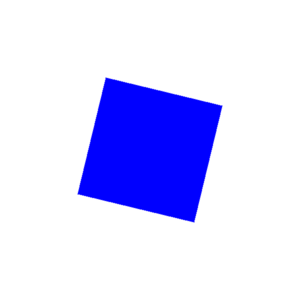

# Shaders - Cuadrado Rotatorio

Autor: Pablo Morales Gómez

Asignatura: Creando Interfaces de Usuario

Curso: 4º

## Introduccion

En esta práctica haremos uso de los *shaders* para crear una escena, para esto solo usaremos *shaders* de tipo fragmento.

## Desarrollo

En realidad, se trata de un código bastante sencillo, en lo que respecta a la parte de *Processing* el código simplemente incluye la llamada para mostrar el *shader* sobre un rectángulo que ocupa la totalidad de la pantalla al tiempo que algunos valores son enviados a la parte de *glsl* para que modifiquen los valores de visualización. Estos valores son *time* (valor *float* que nos indica cuanto tiempo ha pasado y usaremos para afectar a la rotación del cuadrado), la posición del ratón (valor *vec2* para modificar el color del cuadrado en función de donde se encuentre) y , por último, la resolución (valor *vec2* que encierra las dimensiones de la ventana que usamos para centrar la acción en el centro de la pantalla).

La parte de *glsl* muestra un cuadrado en el centro de la pantalla que realiza una rotación sobre el "eje z" (lo ponemos entre comillas ya que, en realidad, es una escena en 2D) que se ve afectada por el tiempo transcurrido, esto hace que gire hacia un lado y luego hacia el otro. Al mismo tiempo, el color se ve afectado por la posición del ratón, concretamente la componente roja será el seno de la componente x del cursor, la verde la tangente de la división de la coordenada x y la y, y, finalmente, la parte azul es el coseno del valor y del ratón.

En lo que respecta a la implementación en sí del programa, para mostrar el triángulo hacemos tres cosas. En primer lugar, centramos la acción en el centro de la imagen, para ello usamos el código extraído en la respuesta más valorada de [esta consulta de StackOverflow](https://stackoverflow.com/questions/33837582/draw-centered-circle). A continuación, fijamos con la variable *size* los límites de nuestro cuadrado, lo sometemos a una rotación con la matriz de rotación usada en anteriores prácticas y, por último, pintamos del color correspondiente todos aquellos píxeles que se encuentran dentro de dichos límites y al resto le aplicamos un color blanco.

## Previsualización del Programa

  

